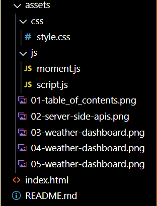
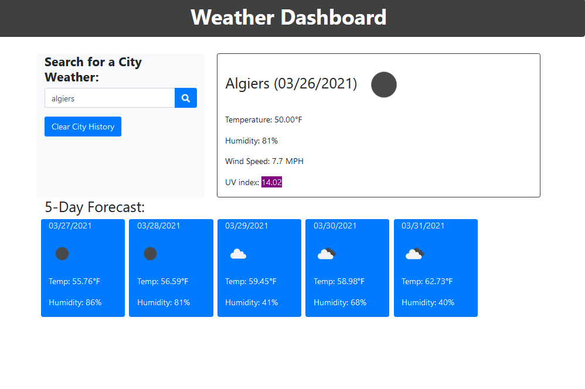
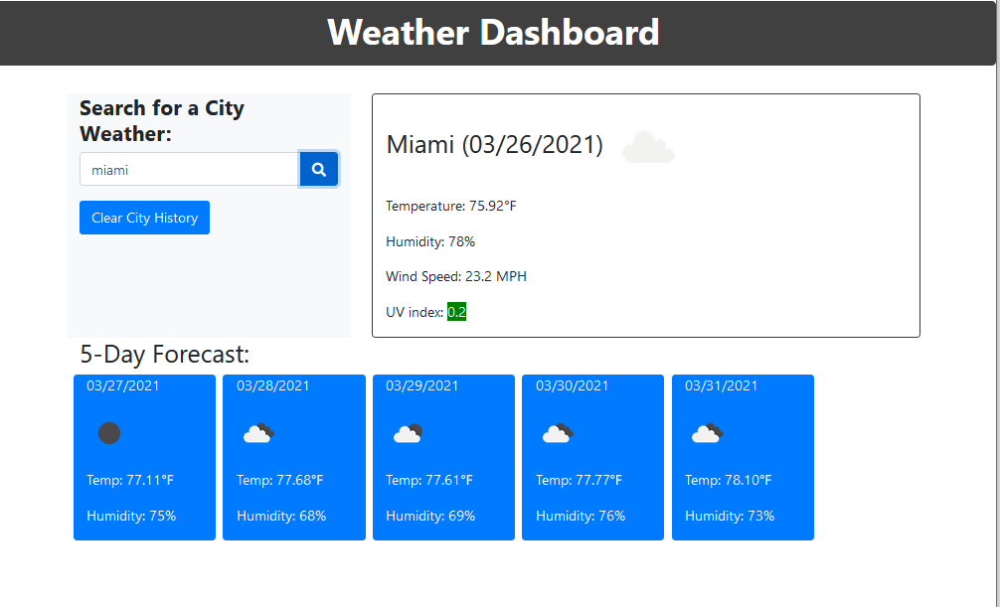
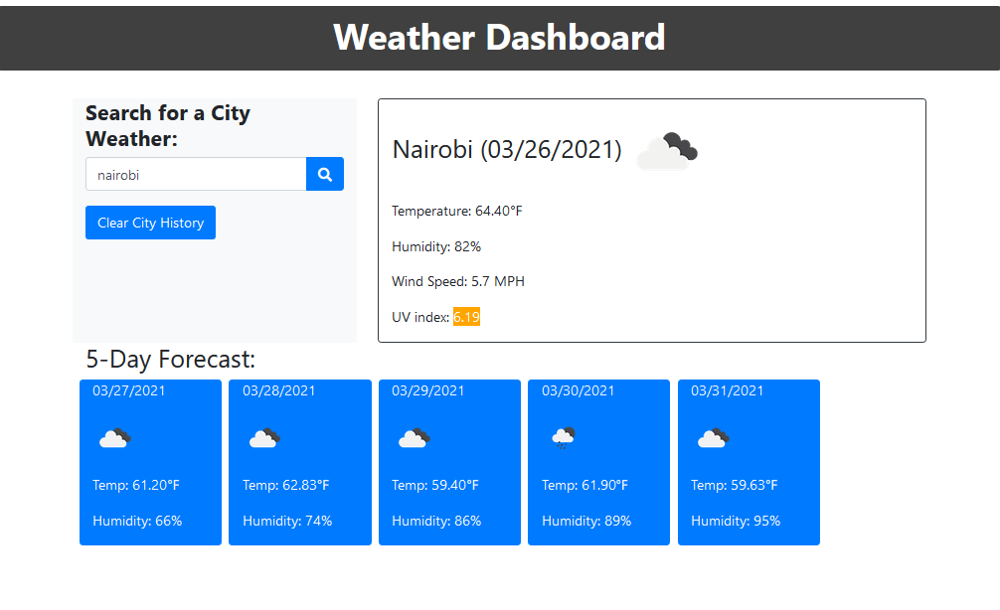

# GT-Coding Bootcamp -- 06 Server-Side APIs: Weather Dashboard

## 1. Overview:

Third-party APIs allow developers to access their data and functionality by making requests with specific parameters to a URL. Developers are often tasked with retrieving data from another application's API and using it in the context of their own. This is a weather dashboard that will run in the browser and feature dynamically updated HTML and CSS.

This dashboard uses the [OpenWeather API](https://openweathermap.org/api) to retrieve weather data for cities.

## 2. Directory Structure

## 3. Mock-Up

The following image shows the web application's appearance and functionality:

## 4. Links to deployed application

[Click here to go to github repository.](https://github.com/willielibet/weather-dashboard.git)

[Click here to go to deployed application.](https://willielibet.github.io/weather-dashboard/)

## 5. Resources

[Resource A](https://19january2017snapshot.epa.gov/sunsafety/uv-index-scale-1_.html)
[Resource B](https://www.youtube.com/watch?v=FN_ffvw_ksE)

[Resource C](https://webdesign.tutsplus.com/tutorials/build-a-simple-weather-app-with-vanilla-javascript--cms-33893)
[Resource D](https://stackoverflow.com/questions/30916387/placeholder-font-size-bigger-than-16px/30916757)

[Resource E](https://www.youtube.com/watch?v=1AwTtgsGdSA)
[Resource F](https://stackoverflow.com/questions/12710843/want-to-move-a-particular-div-to-right/55640633)

[Resource G](https://www.youtube.com/watch?v=FN_ffvw_ksE)
[Resource G](https://www.youtube.com/watch?v=0bec1BmeY4c)
